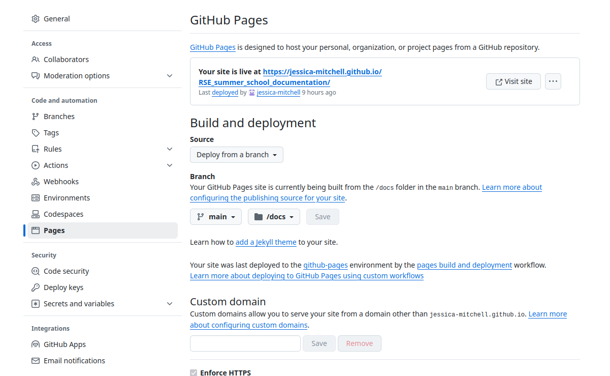

.. _rmarkdown_ghpage:

RMarkdown with GitHub pages
===========================

RMarkdown is an authoring framework for data science.

See the `official documentation here <https://rmarkdown.rstudio.com/lesson-1.html>`_
and the `RMarkdown cheat sheet <https://raw.githubusercontent.com/rstudio/cheatsheets/main/rmarkdown-2.0.pdf>`_

It supports output such as HTML, PDF, shiny applications, and MS Word.

Since it supports HTML, you can put the generated HTML files directly in a GitHub repository, and let GitHub Pages
deploy and host your docs!

How it works
------------

Install RMarkdown from CRAN (prerequisites are R and RStudio).

You write an Rmd file, which contains code chunks and markdown text.

.. literalinclude:: ../docs/index.rmd

Render it with `knitr <http://yihui.name/knitr/>`_ and set HTML format as output.

Create a GitHub repository, clone it, and store your Rmd and HTML file in the ``docs`` folder.

Set up `GitHub pages <https://docs.github.com/en/pages/quickstart>`_.

Under :kbd:`Settings` go to :kbd:`Pages`. Select a Source - in this case we will ``Deploy from a branch``.
We then select branch ``main`` and ``docs`` as the folder we want to build from.

Push your HTML and Rmd files to your GitHub repo. (Make sure you have a file called ``index.html``).
It might take a couple of minutes, but your site will be live at ``https://<you-username>.github.io/<project>``

Output
------

The output looks like this: `R sample project <https://jessica-mitchell.github.io/RSE_summer_school_documentation/>`_

GitHub action
--------------

`GitHub action for RMarkdown <https://github.com/marketplace/actions/github-action-for-rmarkdown>`_
